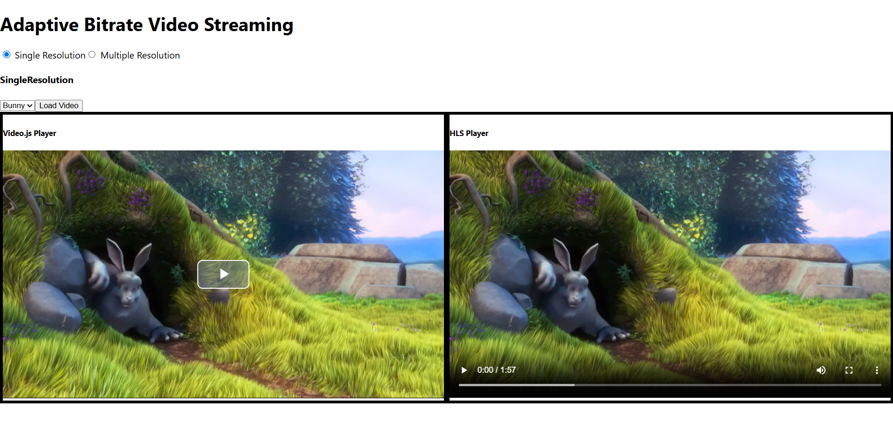

# 🎥 HLS Streaming Project (React + Node.js)

A simple video streaming project built using **HLS.js**, with **React** for the frontend and **Node.js** for the backend. This project demonstrates how to convert MP4 videos into **HLS (.m3u8) format** and stream them efficiently using chunk-based delivery.



## 🚀 Features

- 📡 Video streaming using **HLS.js**
- ⚛️ Frontend built with **React**
- 🖥️ Backend built with **Node.js**
- 📂 API to generate a **single-resolution m3u8 playlist**
- 🎞️ API to generate **multi-resolution (adaptive bitrate) m3u8 playlists**
- 🔄 Fetches playlists from backend and plays video on frontend
- 🚀 Chunk-based video streaming for better performance

---

## 🧩 Tech Stack

### Frontend
- React
- HLS.js

### Backend
- Node.js
- Express
- FFmpeg

---

## 📡 HLS Streaming Overview

To stream videos in chunks using **HLS.js** on the frontend, the video must be in **HLS (HTTP Live Streaming) format**, which uses the `.m3u8` playlist format.

If your videos are stored in `.mp4` format, they **must be converted** to `.m3u8` format before streaming.

This project uses **FFmpeg** on the backend to:
- Convert `.mp4` videos into HLS format
- Generate `.m3u8` playlists
- Split videos into smaller `.ts` chunks for smooth and efficient streaming

---

## 🔌 Backend APIs
Place your video in `videos` folder to convert them into `.m3u8` playlist

### 1️⃣ Create Single-Resolution Playlist
Generates a standard `.m3u8` playlist from an MP4 video.
```http
  GET /exec/:videoName
```

### 2️⃣ Create Multi-Resolution Playlist
Generates an adaptive bitrate HLS playlist with multiple resolutions.
```http
  multi-res-exec/:videoName
```

---

## 🎬 Frontend Flow

1. Fetches `.m3u8` playlist URLs from backend APIs  
2. Loads the playlist using **HLS.js**  
3. Streams video in small chunks  
4. Automatically switches video quality for multi-resolution playlists  

---

## ⚙️ Installation & Setup

### Backend Setup
```bash
cd backend
npm install
npm start
```

### Frontend Setup
```bash
cd frontend
npm install
npm start
```
